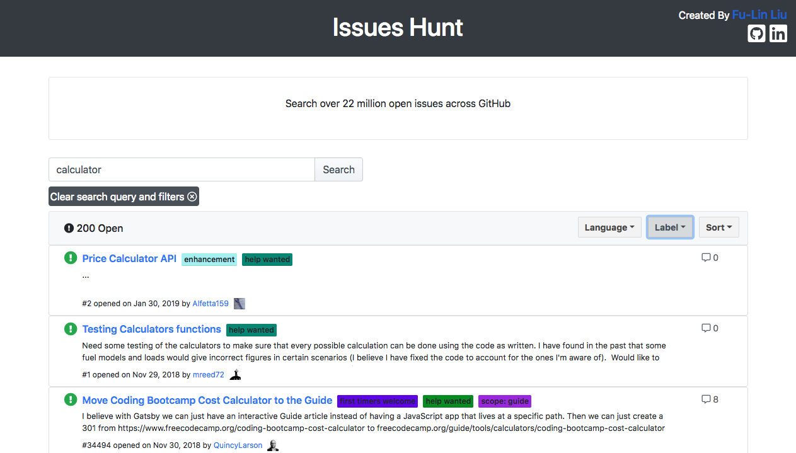

#Issues Hunt

##Use Case
Issues such as “good first issue” or “help wanted” are difficult to find. Right now a user would have to click on a specific repository and look through their issues to apply label filters. Being able to find issues easier would encourage more people, especially novice programmers, to contribute to open source projects.

Filter results by language, label, and sort.

[Live Demo](https://issueshunt.herokuapp.com/)

##Technology
React, HTML, CSS, Bootstrap, Axios, Font-Awesome, Github API
